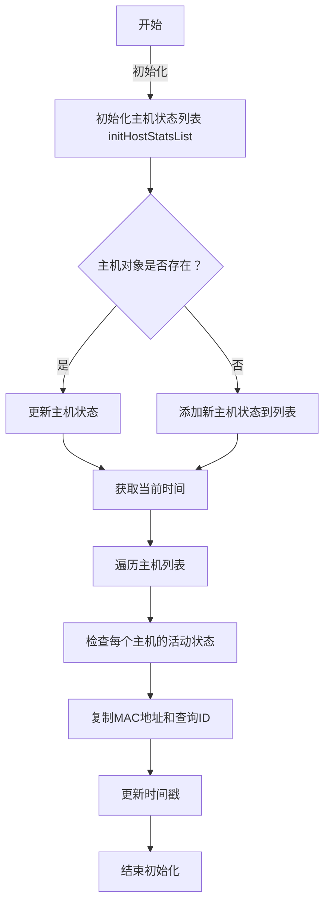
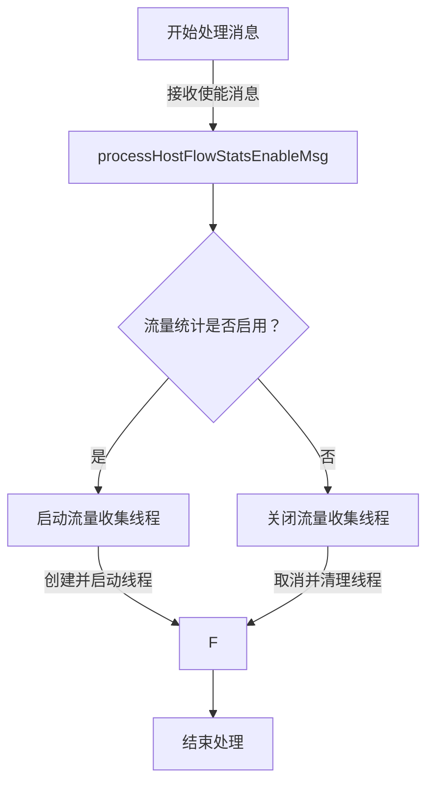
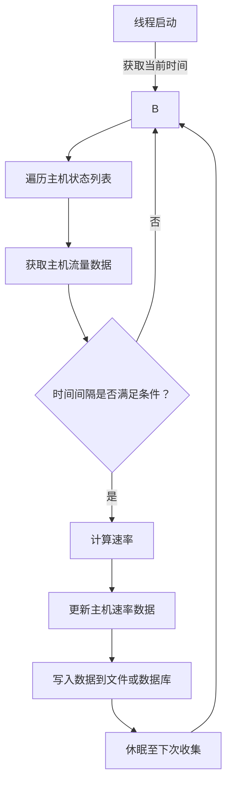
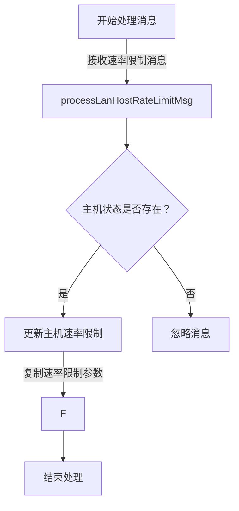
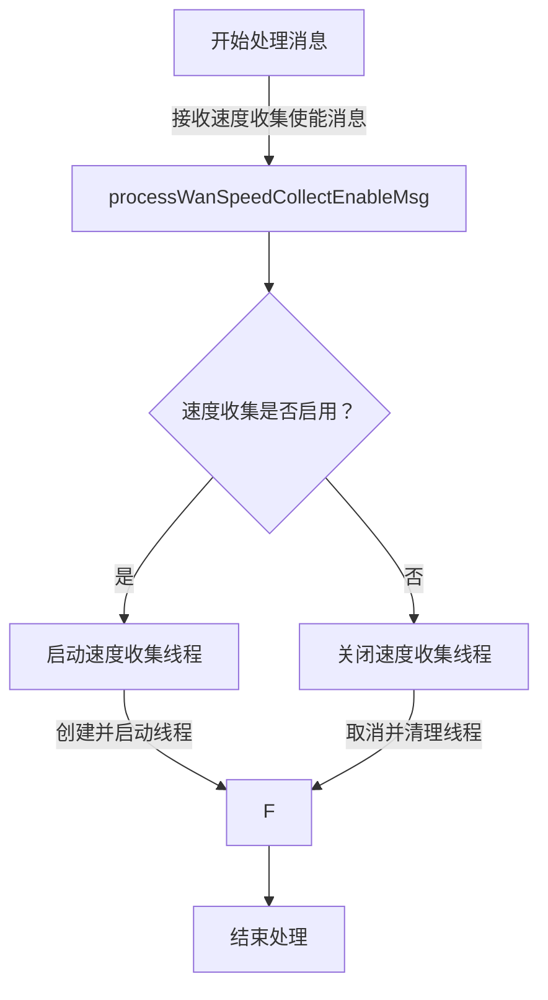

2. **处理流量统计使能消息**:


3. **流量收集和速率计算线程**:


4. **处理主机速率限制消息**:


5. **处理广域网速度收集**:


您可以将上述代码复制到支持Mermaid的Markdown编辑器或工具中，如Typora、Visual Studio Code（安装了相应插件的情况）等，来生成流程图的图片。如果您需要将这些图片保存为文件，您可以在这些编辑器中使用截图工具或导出图片的功能。

```